<!-- Generated by GitHub Profile Agent Console. Edit profile.config.json, then run npm run generate. -->

  <picture>
    <source media="(max-width: 760px) and (prefers-color-scheme: dark)" srcset="./assets/hero/agent-console-f0966721-mobile-dark.svg">
    <source media="(max-width: 760px)" srcset="./assets/hero/agent-console-f0966721-mobile-light.svg">
    <source media="(prefers-color-scheme: dark)" srcset="./assets/hero/agent-console-f0966721-dark.svg">
    <source media="(prefers-color-scheme: light)" srcset="./assets/hero/agent-console-f0966721-light.svg">
    
  </picture>

  

## About Me

I build mobile applications that combine clean design with reliable performance across Android and cross-platform tooling.

## Current Focus

| Area | What I am exploring |
| --- | --- |
| **Mobile Development** | Building cross-platform mobile apps with clean architecture and smooth user experience. |
| **Flutter** | Building fast, single-codebase mobile apps for iOS and Android with Flutter. |
| **Android** | Developing native Android apps with clean architecture and solid performance. |
| **UI/UX** | Designing intuitive, accessible interfaces that make apps easy and enjoyable to use. |

## Featured Work

| Project | Focus | Why it matters |
| --- | --- | --- |
| [**Trofes Mobile**](https://github.com/Tinyasli/trofes-mobile) | Food detection for diet & nutrition | Trofes Mobile detects food objects through the camera and helps users track vegetable and protein intake for diet or bulking programs. |
| [**LibFox**](https://github.com/Tinyasli/LibFox) | Android app for library book management | LibFox is an Android application for managing and organizing a library's book collection. |

## Research Direction

I am interested in building mobile applications that are fast, intuitive, and reliable across platforms, with a focus on clean architecture and great user experience.

## Tech Stack

`Kotlin` · `Java` · `C` · `PostgreSQL`

## Recent Activity

<!-- AUTO:ACTIVITY:START -->
_Recent public activity will appear here after the workflow runs._
<!-- AUTO:ACTIVITY:END -->

---

  Building useful mobile apps and learning something new with every project.

